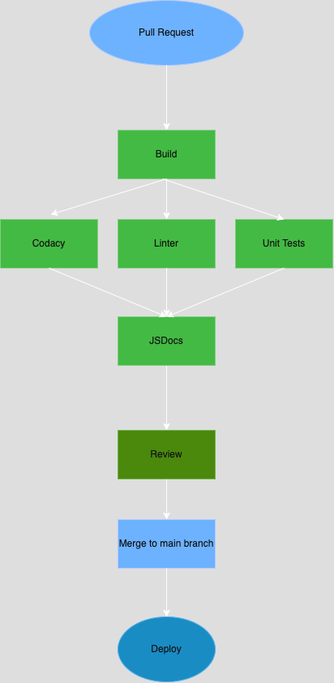

# Phase 1 - CI/CD Pipeline Status

## Overview

Our current CI/CD pipeline is designed to ensure code quality, maintain consistent style, and automate testing and documentation. The goal of Phase 1 was to establish the foundational elements of this pipeline.

## Current Status

The following components of the pipeline are working:

- **Linting and Code Style Enforcement**
  - In our current setup, the JSDoc integration has been configured but not fully tested, so it remains a work in progress.For linting, we have configured rules to cover JavaScript, CSS, Markdown, JSON, and HTML files to ensure code quality and consistency.
  
- **Code Quality via Human Review**
  - Pull request reviews are mandatory for merging into the main branch. Team members conduct human reviews to ensure code quality, readability, and adherence to team standards.

- **Unit Testing**
  -  For unit testing, we have implemented Jest, as used in the labs, and currently have a working sample test in place.

- **Documentation Generation**
  - We have automated the generation of documentation using JSDoc. Updates to documentation are validated within the pipeline.

## In Progress / Planned Work

- **Codacy Integration**
  - **Codacy Static Code Analysis**: This step is **currently not functional**. We are investigating the integration issue with the Codacy CLI and API token recognition.
  
  - **Codacy Analysis**: Regarding Codacy, we plan to set up a method to run Codacy tests locally to streamline testing without needing to push changes to GitHub
