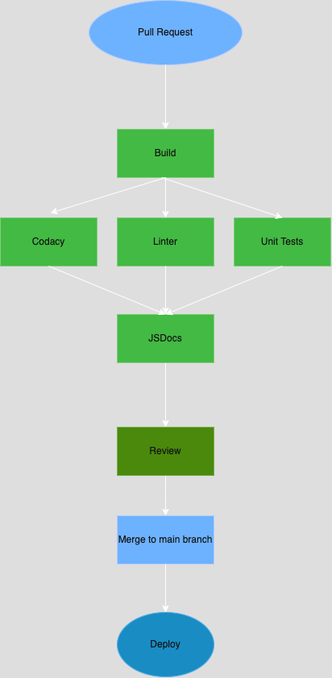

# Phase 2 - CI/CD Pipeline Status

## Overview

Our current CI/CD pipeline is designed to ensure code quality, maintain consistent style, and automate testing and documentation. The goal of Phase 2 was to finish up everything and ensure all parts of the pipeline are working properly.

The overall pipeline as not changed, we've just fixed some bugs and problems in the pipeline. The fixes are listed below.

## Current Status

The following components of the pipeline are working:

- **Linting and Code Style Enforcement**
  - In our current setup, the JSDoc integration has been configured but not fully tested, so it remains a work in progress.For linting, we have configured rules to cover JavaScript, CSS, Markdown, JSON, and HTML files to ensure code quality and consistency.
  
- **Code Quality via Human Review**
  - Pull request reviews are mandatory for merging into the main branch. Team members conduct human reviews to ensure code quality, readability, and adherence to team standards.

- **Unit Testing**
  -  For unit testing, we have implemented Jest, as used in the labs, and currently have a working sample test in place.

## Changes From Phase 1:

- **Documentation Generation**
  - We have automated the generation of documentation using JSDoc. All docs will be automatically genearted when there is a push and will be saved in the docs branch of our repository.

- **Codacy Integration**
  - **Codacy Analysis**: Codacy Analysis CLI has been set up and configured to work properly. The link to to its dashboard is in our readme file. We mainly fixed some configuration issues in Codacy. Also, we added code coverage analysis to Codacy to track how much code is being tested.
  

