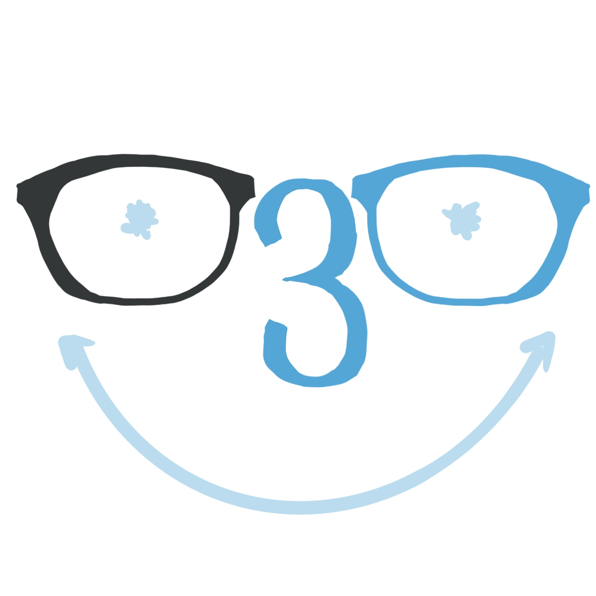

# Nerdy Thirty

## Important Values
1. Effort: Always strive to complete your tasks to the best of your ability and in a timely manner.
2. Communicate Early: If you’re unable to meet a deadline or need more time, let the team know as soon as possible. Transparency helps us all succeed.
3. Ask for Help: Don’t be afraid to speak up if you're unsure or stuck. We’re here to support each other.
4. Support One Another: If a teammate needs help and you’re able to assist, step up and offer support whenever possible.
5. Respect All Ideas: No idea is a bad idea. Be inclusive and respectful of everyone’s contributions.
6. Foster Collaboration: Create an environment where everyone feels comfortable sharing, learning, and growing together.

## Roster 👤

### George Minasyan

-  I'm a 22 year old Computer Science student from Armenia. My hobbies include playing video games, listening to and making music, socializing and hanging out with friends.
- **GitHub Page:** [@invertedvoice](https://invertedvoice.github.io/CSE110/)

### Ali farahbakhsh

-  Hi guys I'm Ali, a CS student. For fun I like to play games, hangout with friends, and go on walks outside.
- **GitHub Page:** [@afarahbakhsh1383](https://afarahbakhsh1383.github.io/cse_110_lab_1/)

### Julia Wu

- Hello, I'm Julia! I'm majoring in CS, and I'm interested in AI and UI. I also like to ski and bake.
- **GitHub Page:** [@juliawu7](https://juliawu7.github.io/user-page/)

### Jay Gao

- I'm Jay, a third year Math & CS major. I often enjoy the outdoors and staying active with sports.
- **GitHub Page:** [@jayygao](https://jayygao.github.io/jay-cse110/)

### Mei Man Teng Lam

- Mei’s brief overview: Hello nerdies I’m a junior majoring in Math CS and originally from Mexico. Some of my hobbies are playing squash and cooking!
- **GitHub Page:** [@meimanteng](https://meimanteng.github.io/CSE110/)

### Aldrin Ilagan

-  Hi guys I'm Ali, a CS student. For fun I like to play games, hangout with friends, and go on walks outside.
- **GitHub Page:** [@ai-aurum](https://ai-aurum.github.io/Pages/)

### Aditya Ilagan

-  My name is Aditya Dutt. I am a junior and I love playing chess and pickleball.
- **GitHub:** [@adutt1010](http://github.com/adutt1010)

### Jonathan Cohen-Wang

-  Hi I'm Jonathan, a third year CS major. I like gaming, drawing, and playing tennis in my free time.
- **GitHub Page:** [@jcohenwang](https://jcohenwang.github.io/CSE110-Lab1/)

### Richard Nie

-  Hi I'm Jonathan, a third year CS major. I like gaming, drawing, and playing tennis in my free time.
- **GitHub Page:** [@nie-chenhao](https://nie-chenhao.github.io/CSE110-Lab1/)

### Kevin Sun

-  Hello! I'm Kevin Sun, a Junior CS Transfer.  I like cooking, cycling, and gaming.
- **GitHub Page:** [@kevinisun](https://kevinisun.github.io/CSE110Lab1/)

### Terri Tai

-  Hi everyone! I'm Terri, a second year computer engineering major in Warren. I like doing magic and playing guitar.
- **GitHub Page:** [@ttai2023](https://ttai2023.github.io/cse110/)

### Cody Lee

-  Hi, I am Cody Lee. I am a Math CS major. I like fishing, archery, and gaming.
- **GitHub Page:** [@codywlee](https://codywlee.github.io/CS110sp25/)

